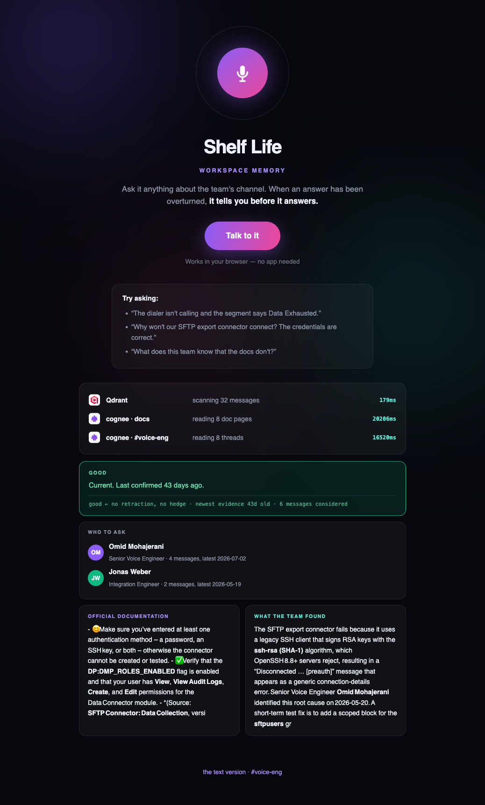

# Shelf Life

**Every answer in a company has one.**

| | |
|---|---|
| **Live — talk to it** | https://shelflife.ringamo.dev |
| **Live — type to it** | https://shelflife.ringamo.dev/text |
| **The channel it reads** | https://shelflife.ringamo.dev/chat |
| **Full repo** | https://github.com/Omid-Mohajerani/shelf-life |
| **Write-up** | [SUBMISSION.md](SUBMISSION.md) |
| **Author** | Omid Mohajerani (solo) |



A workspace memory that tells you **how much to trust its own answers**.

Ask it out loud, or type. While it answers you watch the work: Qdrant lands in ~120ms,
both cognee legs take ~20s, then the verdict, who to ask, and both sources.

Ask a question and you get four things: what the official docs say, what the team actually
found in the channel, **how much to trust it** (`current` / `stale` / `unproven` /
`superseded`), and who to ask.

## Two speeds, on purpose

- **The verdict needs no model.** "Superseded — overturned on 2026-08-04" is a metadata lookup,
  not reasoning. **Qdrant returns it in ~0.1s** and the banner renders immediately.
- **The answer does.** "The dialer was silent because the tenant-level scheduler was failing"
  appears in no single message — **cognee assembles it from the whole thread**, ~15s.

Both are on screen at once, visibly at different speeds.

## The demo

1. **Ask** — *"our SFTP connector won't connect but the credentials are correct."*
   The docs are **confidently wrong**. The channel has the real cause: legacy `ssh-rsa` SHA-1
   signatures, rejected by OpenSSH 8.8+.
2. **Post one message into `#voice-eng`** — *"today's release ships a modern SSH client, the
   workaround is obsolete."* Qdrant takes it in 0.5s; cognee re-reads the channel in ~20s.
3. **Ask the same question again** — the answer is now *"…making the workaround obsolete, but
   older deployments must still apply the temporary change."*

**It didn't just flag the old answer. It revised what it knows, and reconciled the old advice
with the new fact.**

> Cognee holds the knowledge. Qdrant holds the receipts.

## Run it

```bash
pip install -r requirements.txt
export COGNEE_CLOUD_URL=... COGNEE_CLOUD_API_KEY=... QDRANT_URL=http://127.0.0.1:6333
python3 tools/build_shelflife_corpus.py corpus
python3 tools/ingest_shelflife.py corpus
cd app && uvicorn main:app --host 0.0.0.0 --port 8000
```

Full source, corpus and tooling: **https://github.com/Omid-Mohajerani/shelf-life**
